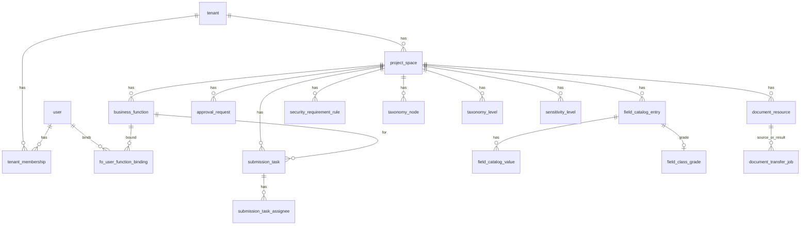

# DSMS 数据模型（对齐前端 Mock + 文档资源）

> **状态**：v1 规划稿（2026-05）。  
> **真源优先级**：本文与 `DSMS_IMPLEMENTATION_SPEC.md` 冲突时，以 **产品确认后的规格修订** 为准；实现前须将 §4.3 与附录 A 同步增补。  
> **目标**：数据库表结构与 **`frontend/src/data/*Mock*.js`** 字段语义 **1:1 可映射**，并新增 **文档资源** 模块承担 Excel 快捷导入/导出与法规文件库。

---

## 1. 设计原则

1. **多项目 + 空间**：除平台级表外，业务表均含 **`tenant_id`**；空间内数据含 **`project_space_id`**（法规库等租户级资源可为空）。
2. **主键**：库内统一 **`INTEGER` 自增 PK**；API 层可暴露 `public_id`（UUID/业务键）供前端过渡，但 mock 的 string id 不写入 PK。
3. **JSON 列**：逻辑树、快照、治理结果等用 **`TEXT` 存 JSON**（SQLite），列名以 `_json` 结尾；OpenAPI Schema 与 TS 契约须同步。
4. **审批**：统一 **`approval_request`** 表；原 `field_request` / `business_function_option_request` 的「待审」视图由本表 + 业务表状态派生，**`work-orders`** 仍为查询聚合，非独立表。
5. **填报**：前端 **`SubmissionTask`** 为 FO 门户主实体，**取代**原规格中偏简化的 `field_usage_report` 作为主流程载体（后者可保留只读兼容或 Phase 3 合并导出用）。

---

## 2. 表清单总览（共 35 张）

| 分组 | 表名 | 对应前端 Mock / 页面 |
|------|------|----------------------|
| **A 平台** | `user` | 登录 / 用户管理 |
| | `tenant` | `fetchTenants` / `usePortalTenantContext` |
| | `tenant_creator_allowlist` | 规格 §6 |
| | `tenant_membership` | 项目成员 |
| | `platform_audit_log` | 规格 §8 IAM 键 |
| **B 空间** | `project_space` | 顶栏空间（待接 API） |
| **C 业务功能** | `business_function` | `fetchBusinessFunctions` |
| | `fo_user_function_binding` | `fo-function-bindings` API |
| | `fo_function_security_tag` | 任务 `foRelevanceConclusion` 推导 |
| **D 审批** | `approval_request` | `portalApi` approval-requests |
| **E 填报任务** | `submission_task` | `portalApi` submission-tasks |
| | `submission_task_assignee` | `foExtraAssignees` |
| **F 字段主数据** | `field_catalog_entry` | `dataFieldCatalogMock` |
| | `field_catalog_value` | `foSubmissionGovernanceMock` 生命周期值 |
| | `field_catalog_change_request` | `CatalogRequest`（create/delete） |
| **G 生命周期表单** | `lifecycle_field_config` | `lifecycleFieldConfigMock` |
| **H 相关性** | `questionnaire_question` | `relevanceQuestionnaireMock` |
| | `relevance_rule` | `relevanceExpressionMock` |
| | `relevance_assessment_submission` | FO 相关性填报实例（可选，任务内嵌时可不单独暴露） |
| | `relevance_assessment_answer` | 同上 |
| **I 分类树** | `taxonomy_level` | `taxonomyLevelMock` |
| | `taxonomy_node` | `taxonomyNodeMock` |
| **J 密级** | `sensitivity_level` | `sensitivityLevelMock` |
| | `field_class_grade` | `fieldClassGradeBindingMock` |
| **K 安全要求** | `security_requirement_rule` | `securityRequirementRulesMock` |
| | `field_security_requirement` | Phase 2 字段级检查（保留，与规则页分工见 §5.8） |
| **L 分类分级引擎** | `classification_matrix` | 规格 Phase 2（前端页待接） |
| | `classification_rule` | 同上 |
| | `classification_result` | 同上 |
| | `classification_audit_log` | 同上 |
| **M 治理** | `governance_change_log` | Phase 3 |
| **N 文档资源** | `document_resource` | 文档资源模块 |
| | `document_transfer_job` | 导入/导出作业 |

**弃用或降级（实现时二选一并在迁移说明中写明）**：

- `field_request` → 由 `field_catalog_change_request` + `approval_request` 覆盖。
- `business_function_option` / `business_function_option_request` → 由 `business_function` + `approval_request` 覆盖。
- `field_usage_report` / `field_usage_report_item` → 由 `submission_task` + 导出作业覆盖；若需兼容旧 API，可做 DB 视图或适配层。

---

## 3. 实体关系（概览）

---

## 4. 分表字段定义

### 4.1 平台（A）

#### `user`（已有，微调）

| 列 | 类型 | 说明 |
|----|------|------|
| `platform_role` | `VARCHAR(32)` | `system_admin` \| `security_fo` \| `function_fo`（门户 JWT 外以库为准） |
| 其余 | — | 同规格 §4.1 |

#### `tenant`（已有）

| 列 | 说明 |
|----|------|
| `copy_meta_json` | 可选；对齐前端项目「复制来源」`copyMeta`（`fields/rules/members/submissionAudited`） |

#### `platform_audit_log`（新建）

| 列 | 类型 | 说明 |
|----|------|------|
| `id` | PK | |
| `tenant_id` | FK nullable | 平台级操作可为空 |
| `user_id` | FK | |
| `behavior_key` | string | 规格 §8 |
| `label_snapshot` | string nullable | |
| `detail_json` | TEXT nullable | |
| `created_at` | datetime | |

---

### 4.2 空间（B）

#### `project_space`（已有）

无结构变更；前端壳层接 API 后，顶栏「当前项目 + 当前空间」均落库。

---

### 4.3 业务功能（C）

#### `business_function`（新建）

替代硬编码 `MOCK_SUBMISSION_FUNCTIONS` 与旧 `business_function_option`。

| 列 | 类型 | 说明 |
|----|------|------|
| `id` | PK | |
| `tenant_id`, `project_space_id` | FK | |
| `function_key` | string | 空间内唯一，如 `field_usage` |
| `name` | string | 显示名 |
| `description` | string nullable | |
| `requires_fo_binding` | bool | 对齐 `functionFoBound` |
| `sort_order` | int | |
| `is_active` | bool | |
| `created_at`, `updated_at` | datetime | |

**唯一约束**：`(tenant_id, project_space_id, function_key)`

#### `fo_user_function_binding`（新建）

| 列 | 类型 | 说明 |
|----|------|------|
| `id` | PK | |
| `tenant_id`, `project_space_id` | FK | |
| `user_id` | FK | 功能 FO |
| `business_function_id` | FK | |
| `status` | string | `active` \| `pending`（审批通过前为 pending） |
| `approved_via_request_id` | FK nullable | → `approval_request.id` |
| `created_at`, `updated_at` | datetime | |

**唯一约束**：`(tenant_id, project_space_id, user_id, business_function_id)`

#### `fo_function_security_tag`（新建）

| 列 | 类型 | 说明 |
|----|------|------|
| `id` | PK | |
| `tenant_id`, `project_space_id` | FK | |
| `business_function_id` | FK | |
| `user_id` | FK | 打标的功能 FO |
| `irrelevant` | bool | |
| `tagged_at` | datetime | |
| `submission_task_id` | FK nullable | 来源任务 |

**唯一约束**：`(tenant_id, project_space_id, business_function_id, user_id)`

---

### 4.4 审批（D）

#### `approval_request`（新建）

| 列 | 类型 | 说明 |
|----|------|------|
| `id` | PK | |
| `tenant_id`, `project_space_id` | FK | |
| `request_type` | string | 见下表 |
| `status` | string | `pending` \| `approved` \| `rejected` |
| `title` | string | 摘要 |
| `payload_json` | TEXT | 类型相关载荷 |
| `requester_user_id` | FK | |
| `reviewer_user_id` | FK nullable | |
| `reject_reason` | string nullable | |
| `requested_at`, `reviewed_at` | datetime | |

**`request_type` 枚举（对齐 `approvalRequestsMock.js`）**：

| 值 | payload_json 要点 | 通过后副作用 |
|----|-------------------|--------------|
| `fo_function_binding` | `desired_function_ids[]`, `previous_function_ids[]`, `reason` | 更新 `fo_user_function_binding` |
| `field_catalog_create` | `change_request_id`, `proposed_label`, … | 插入 catalog + 关闭 change_request |
| `field_catalog_delete` | `change_request_id`, `catalog_entry_id`, … | 删除 catalog |
| `submission_fill_cancel` | `task_id`, `function_id`, `reason` | 任务取消 |
| `submission_fill_review` | `task_id`, `function_id` | 任务 `audit_status=approved` |

索引：`(tenant_id, project_space_id, status, requested_at DESC)` 供审批中心与模糊搜索。

---

### 4.5 填报任务（E）

#### `submission_task`（新建）

| 列 | 类型 | 对齐 Mock 字段 |
|----|------|----------------|
| `id` | PK | `id` |
| `tenant_id`, `project_space_id` | FK | — |
| `business_function_id` | FK | `functionId` |
| `title` | string | `title` |
| `internal_note` | string nullable | `internalNote` |
| `status` | string | `draft` \| `dispatched` |
| `dispatch_note` | string nullable | `dispatchNote` |
| `dispatched_at` | datetime nullable | `dispatchedAt` |
| `created_at` | datetime | `createdAt` |
| `fo_fill_status` | string | `foFillStatus` |
| `fo_fill_content_summary` | string nullable | `foFillContentSummary` |
| `fo_fill_form_snapshot_json` | TEXT nullable | `foFillFormSnapshot` |
| `fo_fill_lifecycle_rows_json` | TEXT nullable | `foFillLifecycleRows` |
| `fo_cancellation_requested` | bool | `foCancellationRequested` |
| `fo_cancellation_reason` | string nullable | `foCancellationReason` |
| `fo_cancel_approval_pending` | bool | `foCancelApprovalPending` |
| `fo_workflow_step` | string nullable | `foWorkflowStep`：`relevance` \| `lifecycle` \| `done` |
| `fo_relevance_conclusion` | string nullable | `relevant` \| `irrelevant` |
| `fo_relevance_fill_row_json` | TEXT nullable | `foRelevanceFillRow` |
| `fo_governance_result_json` | TEXT nullable | `foGovernanceResult` |
| `audit_status` | string nullable | `auditStatus` |
| `audit_comment` | string nullable | `auditComment` |
| `audited_at` | datetime nullable | `auditedAt` |
| `created_by_user_id` | FK nullable | 数据安全 FO 下发人 |
| `assignee_user_id` | FK nullable | 主责功能 FO |

#### `submission_task_assignee`（新建，可选）

| 列 | 说明 |
|----|------|
| `submission_task_id` | FK |
| `label` | 协同人显示名 |
| `user_id` | FK nullable |
| `fo_fill_status`, `fo_fill_form_snapshot_json`, … | 与主任务相同子集 |

---

### 4.6 字段主数据（F）

#### `field_catalog_entry`（调整）

| 列 | 说明 |
|----|------|
| `label` | 对齐 mock `label`（可与 `field_name` 合并为单列 `label`，API 别名 `field_name`） |
| `description` | mock 有，后端需补 |
| `identifier_key` | 系统生成或 `suggest-identifier-key` |
| `taxonomy_code` | 已有 |
| `data_type`, `source_system` | 可选，导入 Excel 时填 |

#### `field_catalog_value`（新建）

存储 **`foSubmissionGovernanceMock`** 中按 catalog 条目聚合的生命周期扩展列值。

| 列 | 说明 |
|----|------|
| `field_catalog_entry_id` | FK |
| `field_key` | 生命周期字段 key |
| `value_text` | 统一文本存储；多选 JSON 数组字符串化 |

**唯一约束**：`(tenant_id, project_space_id, field_catalog_entry_id, field_key)`

#### `field_catalog_change_request`（新建）

| 列 | 对齐 Mock |
|----|-----------|
| `request_type` | `create` \| `delete` |
| `catalog_entry_id` | FK nullable |
| `proposed_label`, `proposed_description` | |
| `status` | `pending` \| `approved` \| `rejected` |
| `requester_user_id`, `reviewed_at`, `reject_reason` | |

与 `approval_request` 通过 `payload.change_request_id` 关联。

---

### 4.7 生命周期表单（G）

#### `lifecycle_field_config`（调整）

| 列 | Mock 字段 |
|----|-----------|
| `field_key`, `label` | ✓ |
| `input_type` | `field_type` 改名或 API 映射 |
| `is_builtin` | 内置 `data_field`, `business_function` |
| `required`, `help_text`, `sort_order` | ✓ |
| `min_length`, `max_length` | 放入 `validation_json` 或独立列 |
| `regex_pattern`, `regex_error_message` | `validation_json` |
| `allowed_values_json` | `allowed_values[]` |

---

### 4.8 相关性（H）

#### `questionnaire_question`（调整）

| 列 | 说明 |
|----|------|
| `options_json` | `[{ "id", "label", "sort_order" }]`，对齐嵌套 `options` |

#### `relevance_rule`（调整）

| 列 | 说明 |
|----|------|
| `logic_root_json` | 逻辑树（原 `expression` 废弃或存 legacy） |
| `conclusion_when_true` | `relevant` \| `irrelevant` |
| `conclusion_when_false` | 同上 |

逻辑树节点契约与 `relevanceLogicTree.js` 一致。

---

### 4.9 分类树与密级（I、J）

#### `taxonomy_level`（新建）

| 列 | Mock |
|----|------|
| `level` | 层级序号 0=根 |
| `name`, `description` | |
| `sort_order`, `updated_at` | |

#### `taxonomy_node`（已有，API 对齐 string id 映射）

#### `sensitivity_level`（新建）

| 列 | Mock |
|----|------|
| `code`, `label`, `description` | |
| `sort_order` | 分级阶梯序（与安全要求 `grade::` 谓词一致） |

#### `field_class_grade`（已有）

`grade_label` 引用 `sensitivity_level.label` 或 `code`（实现时统一一种）。

---

### 4.10 安全要求（K）

#### `security_requirement_rule`（新建）

| 列 | Mock |
|----|------|
| `rule_name` | |
| `trigger_root_json` | `trigger_root` |
| `action_content_html` | `action.content_html` |
| `is_active` | |
| `updated_at` | |

**与 `field_security_requirement` 分工**：

- **规则页**：空间级规则 + 触发树 + 富文本动作（治理识别、`foGovernanceResult`）。
- **字段级表**：Phase 2 求值 API（`min_grade` / `max_length` 等）保留，供矩阵/导出/合规检查；前端当前 mock 未用，但规格 §7.2 仍有效。

---

### 4.11 分类分级引擎（L）

保持现有 `classification_*` 四表结构；前端接 API 时与 `taxonomy_code`、`sensitivity_level` 联动。矩阵 `cells_json` 见 `DECISIONS.md` D3。

---

### 4.12 治理（M）

`governance_change_log` 不变；文档模块的导入/导出成功亦写一条，`behavior_key` 见 §6。

---

## 5. 文档资源模块（N）

### 5.1 职责

1. **法规文件库**：上传、分类、检索、下载数据安全相关法规/标准 PDF、Word 等（**不参与**业务表行级 FK，仅 metadata + 文件存储）。
2. **Excel 枢纽**：为各业务模块提供 **模板下载 → 填写 → 上传导入** 与 **按筛选条件导出**；作业异步或同步均可，须留 **作业记录** 与 **结果文件**（含错误行报告）。
3. **与 Phase 3 配置包关系**：`POST /config/export|import` 面向 **整包 JSON/ZIP**；文档资源面向 **业务人员 Excel 快捷操作**，二者并存，导出格式不同。

### 5.2 表：`document_resource`

| 列 | 类型 | 说明 |
|----|------|------|
| `id` | PK | |
| `tenant_id` | FK | |
| `project_space_id` | FK nullable | 空=租户级（法规、全项目模板） |
| `resource_kind` | string | 见枚举 |
| `module_key` | string nullable | 业务模块键，法规为空 |
| `title` | string | |
| `description` | string nullable | |
| `original_file_name` | string | |
| `mime_type` | string | |
| `file_size_bytes` | int | |
| `storage_path` | string | 相对 `DSMS_UPLOAD_ROOT/{tenant_id}/...` |
| `checksum_sha256` | string nullable | |
| `tags_json` | TEXT nullable | 法规标签，如 `["个人信息","汽车数据"]` |
| `regulation_meta_json` | TEXT nullable | `{ "doc_number", "issuer", "effective_date", "expiry_date" }` |
| `uploaded_by_user_id` | FK | |
| `is_archived` | bool | |
| `created_at`, `updated_at` | datetime | |

**`resource_kind` 枚举**：

| 值 | 用途 |
|----|------|
| `regulation` | 数据安全法规/标准文件 |
| `import_template` | 某模块官方导入模板（xlsx） |
| `import_upload` | 用户上传待导入文件 |
| `export_artifact` | 系统生成的导出结果 |
| `import_error_report` | 导入失败行报告（xlsx/csv） |

### 5.3 表：`document_transfer_job`

| 列 | 类型 | 说明 |
|----|------|------|
| `id` | PK | |
| `tenant_id`, `project_space_id` | FK | |
| `direction` | string | `import` \| `export` |
| `module_key` | string | 见 §5.4 |
| `status` | string | `pending` \| `running` \| `succeeded` \| `failed` \| `cancelled` |
| `source_resource_id` | FK nullable | 导入源文件 |
| `result_resource_id` | FK nullable | 导出物或错误报告 |
| `request_params_json` | TEXT | 导出筛选、导入 `dry_run` 等 |
| `result_summary_json` | TEXT | `{ total_rows, created, updated, skipped, errors[] }` |
| `error_message` | string nullable | |
| `created_by_user_id` | FK | |
| `created_at`, `started_at`, `completed_at` | datetime | |

### 5.4 模块注册表（`module_key`）

实现于代码常量 **`DOCUMENT_MODULE_REGISTRY`**（不必入库），每项包含：

| `module_key` | 中文名 | 导入 | 导出 | 目标表 |
|--------------|--------|------|------|--------|
| `field_catalog` | 数据字段主表 | ✓ | ✓ | `field_catalog_entry` |
| `field_class_grade` | 密级绑定 | ✓ | ✓ | `field_class_grade` |
| `sensitivity_level` | 密级定义 | ✓ | ✓ | `sensitivity_level` |
| `taxonomy_level` | 分类树层级 | ✓ | ✓ | `taxonomy_level` |
| `taxonomy_node` | 分类树节点 | ✓ | ✓ | `taxonomy_node` |
| `field_taxonomy_binding` | 字段—分类绑定 | ✓ | ✓ | `field_catalog_entry.taxonomy_code` |
| `lifecycle_field_config` | 生命周期元字段 | ✓ | ✓ | `lifecycle_field_config` |
| `relevance_questionnaire` | 相关性问卷 | ✓ | ✓ | `questionnaire_question` |
| `business_function` | 业务功能选项 | ✓ | ✓ | `business_function` |
| `submission_task` | 填报任务清单 | — | ✓ | `submission_task`（摘要列） |
| `security_requirement_rule` | 安全要求规则 | — | ✓ | `security_requirement_rule`（摘要；规则体仍建议 JSON 包） |
| `classification_matrix` | 分类矩阵 | ✓ | ✓ | `classification_matrix` |
| `classification_result` | 分类分级结果 | — | ✓ | `classification_result` |

法规文件 **不占用 `module_key`**，走 `resource_kind=regulation` 独立列表。

### 5.5 HTTP API（规划）

前缀：**租户级** `/api/v1/dsms/tenants/{tenant_id}/documents`；空间级导入导出 **`.../spaces/{space_id}/documents`**。

| 方法 | 路径 | 说明 |
|------|------|------|
| GET | `.../documents/resources` | 分页列表；Query: `kind`, `module_key`, `q` |
| POST | `.../documents/resources` | 上传法规或文件（multipart） |
| GET | `.../documents/resources/{id}/download` | 下载 |
| PATCH | `.../documents/resources/{id}` | 改标题、标签、归档 |
| GET | `.../documents/modules` | 返回注册表（导入/导出能力） |
| GET | `.../documents/modules/{module_key}/template` | 下载导入模板 xlsx |
| POST | `.../spaces/{space_id}/documents/import` | 创建 import job + 文件 |
| POST | `.../spaces/{space_id}/documents/export` | 创建 export job |
| GET | `.../documents/jobs` | 作业列表 |
| GET | `.../documents/jobs/{job_id}` | 作业详情 + summary |

权限建议：

- **法规库**：`tenant_admin` / `security_fo` 可写；`tenant_member` 只读。
- **业务 Excel 导入**：按模块 — 字段/密级等多为 `security_fo`；功能 FO 可读模板、不可改法规。
- **导出**：与对应模块读权限一致。

### 5.6 存储与环境变量

| 变量 | 说明 |
|------|------|
| `DSMS_UPLOAD_ROOT` | 默认 `./uploads`；法规与 xlsx 均落盘，SQLite 只存 metadata |
| `DSMS_UPLOAD_MAX_BYTES` | 单文件上限 |

### 5.7 前端页面规划

| 路由 | 区块 |
|------|------|
| `/document-resource` | Tab1 **法规文件** / Tab2 **Excel 导入导出** / Tab3 **作业记录** |

侧栏 `documentResource` 在接 API 后重新打开（当前 mock 阶段为 `false`）。

---

## 6. 审计键（文档模块，待入附录 A 或 §8）

| behavior_key | label |
|--------------|-------|
| `document-resource-upload` | 数据安全治理：文档资源上传 |
| `document-resource-archive` | 数据安全治理：文档资源归档 |
| `document-import-start` | 数据安全治理：Excel 导入作业 |
| `document-export-start` | 数据安全治理：Excel 导出作业 |

---

## 7. Mock → 表映射速查

| sessionStorage key | 主表 |
|--------------------|------|
| `dsms_portal_mock_projects_v1` | `tenant` |
| `dsms_mock_submission_tasks_v1` | `submission_task` (+ assignee) |
| `dsms_mock_approval_requests_v1` | `approval_request` |
| `dsms_mock_fo_bound_functions_v1` | `fo_user_function_binding` |
| `dsms_mock_fo_function_security_tags_v1` | `fo_function_security_tag` |
| `dsms_mock_data_field_catalog_v1` | `field_catalog_entry` |
| `dsms_mock_data_field_catalog_requests_v1` | `field_catalog_change_request` |
| `dsms_mock_lifecycle_field_config_v1` | `lifecycle_field_config` |
| `dsms_mock_field_lifecycle_values_v1` | `field_catalog_value` |
| `dsms_mock_relevance_questionnaire_v1` | `questionnaire_question` |
| `dsms_mock_relevance_expression_v2` | `relevance_rule` |
| `dsms_mock_security_requirement_rules_v1` | `security_requirement_rule` |
| `dsms_mock_taxonomy_levels_v1` | `taxonomy_level` |
| `dsms_mock_taxonomy_nodes_v1` | `taxonomy_node` |
| `dsms_mock_sensitivity_levels_v1` | `sensitivity_level` |
| `dsms_mock_field_class_grade_bindings_v1` | `field_class_grade` |

---

## 8. 建议实施顺序

1. **迁移基线**：Alembic 从现有 `models.py` 出 baseline；新增空表不破坏现有 Phase 1–3 路由。
2. **壳层**：`tenant` / `project_space` / `tenant_membership` 接前端顶栏。
3. **主数据 + 分类**：catalog、taxonomy、sensitivity、lifecycle → **文档资源导出/导入** 可先打通 2–3 个模块验证管道。
4. **审批 + FO 绑定 + 填报任务**：替换三块最大 mock。
5. **相关性 + 安全规则**：JSON 契约单测对齐 `*LogicTree.js`。
6. **法规库 UI**：与 Excel 枢纽同页不同 Tab。
7. **弃用表清理**：在适配层稳定后删除或标记 deprecated `field_usage_report` 等。

---

## 9. 相关文档

- 实施规格：`DSMS_IMPLEMENTATION_SPEC.md` §4、§7
- 待确认决策：`DECISIONS.md`（新增 D8 文档资源）
- 前端依赖（待建页）：`frontend-backend-deps/document-resource.md`
